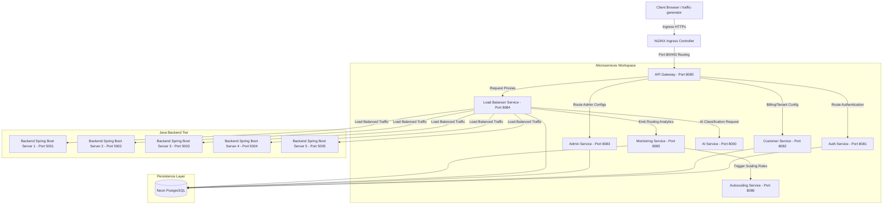

# SmartLB-AI: AI-Driven Multi-Tenant Load Balancer as a Service

SmartLB-AI is a production-grade SaaS application designed to manage multi-tenant HTTPs load balancing with real-time analytics, autoscaling, and AI-enabled traffic routing.

## 🏗️ Architecture Layout



### Port Mappings Directory

| Component | Technology | Default Local Port | Description |
|---|---|---|---|
| Ingress Proxy | NGINX | 80 / 443 | Entry point routing frontend and Gateway |
| `frontend` | React + Vite | 3000 / 5173 | Administration Portal & Tenant Dashboard |
| `api-gateway` | Spring Boot 3.x | 8080 | Gateway routing with rate limiting |
| `auth-service` | Spring Boot 3.x | 8081 | Authentication, MFA, Tenant Tokens (JWT) |
| `customer-service` | Spring Boot 3.x | 8082 | Tenant registration and site targets |
| `admin-service` | Spring Boot 3.x | 8083 | Global platform dashboards & limits control |
| `loadbalancer-service`| Spring Boot 3.x | 8084 | Custom request dispatcher and health loops |
| `monitoring-service` | Spring Boot 3.x | 8085 | Realtime analytics and health reports |
| `autoscaling-service` | Spring Boot 3.x | 8086 | Triggers creation of virtual mock backends |
| `ai-service` | FastAPI (Python) | 8000 | Predictive traffic anomaly classification |
| Mock Backend 1 | Spring Boot 3.x | 5001 | Java target server instance 1 |
| Mock Backend 2 | Spring Boot 3.x | 5002 | Java target server instance 2 |
| Mock Backend 3 | Spring Boot 3.x | 5003 | Java target server instance 3 |
| Mock Backend 4 | Spring Boot 3.x | 5004 | Java target server instance 4 |
| Mock Backend 5 | Spring Boot 3.x | 5005 | Java target server instance 5 |

## 🚀 Running Locally with Docker Compose

Ensure Docker Desktop is running, and you have configured `.env` file from `.env.example`:

```bash
cp .env.example .env
```

### Development Mode

```bash
docker compose -f docker-compose.yml -f docker-compose.dev.yml up -d --build
```

### Production Mode

```bash
docker compose -f docker-compose.yml -f docker-compose.prod.yml up -d --build
```